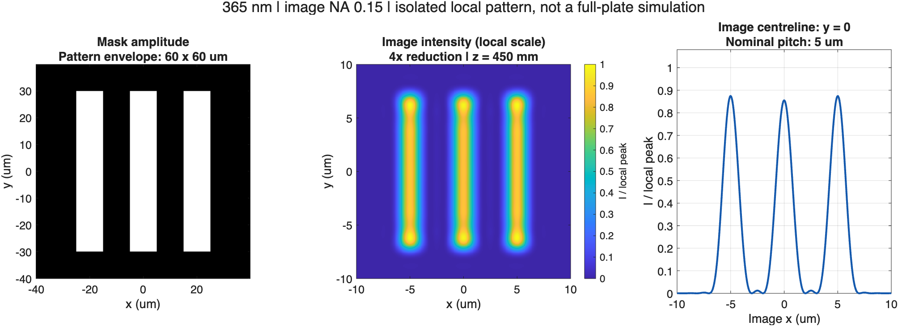

# Optical Lithography Simulator · MATLAB

Explore how illumination, a mask and a finite pupil form an optical image. Follow the wave field from the source to the image, inspect an XY slice, and see which mask details survive diffraction and imaging.

**A scalar, low-NA teaching simulator—not an industrial stepper design or a full-mask Maxwell solver.**



The figure is calculated from the startup settings: a 60 µm local pattern, 365 nm wavelength, image-side NA 0.15 and 4× reduction. The three image lines are 5 µm apart. Mask amplitude and image intensity are different quantities; the image is locally normalized to show its shape.

## Start here

1. Download and extract this repository, or clone it.
2. In MATLAB, set **Current Folder** to the extracted project folder.
3. Run:

```matlab
lithography_specular_gui
```

Tested with **MATLAB R2026a on macOS**. Dependency analysis of the app entry point reports MATLAB only, with no additional toolbox requirement detected. MATLAB is required; this is not a browser app or a standalone executable. Other releases and operating systems have not been certified. No downloaded data or credentials are needed.

The app starts at **Image, z = 450 mm**. The lower-right panel should show three bright lines. Select **Mask + 1 um** and **Show XY** to inspect near-mask diffraction. Click **Update YZ** for the full-path preview; automatic preview calculation is off initially.

## What you can explore

- Eight source types, including point, circular, annular, dipole and editable freeform weights.
- Seven amplitude masks, including apertures, line gratings, a 2D grating and a cross.
- Seven pupil types, including annular/slit pupils and an editable freeform transmission.
- Connected Gaussian-emitter illumination, near-mask scalar diffraction and an ideal two-lens relay.
- Physical-coordinate XY slices and reduced-source YZ/XZ previews.
- Independent display scales for weak signals, plus sampling and model-validity checks.

## Folder layout

```text
optical-lithography-simulator-matlab/
├── lithography_specular_gui.m   Main app — run this
├── lithography_setup.m          Set up paths for scripts and tests
├── src/
│   ├── config/                  Defaults, presets and settings checks
│   ├── optics/                  Source, diffraction and imaging calculations
│   └── ui/                      Plotting, editors and window helpers
├── tests/                       Numerical and display checks
│   └── fixtures/                Mathematical benchmark settings
├── tools/                       Documentation figure generator
├── docs/                        Guides, equations and validation record
│   └── assets/                  Published example figures
└── outputs/                     Local screenshots, data and previous results
```

The GUI sets up its paths automatically. For direct use of helper functions or tests, run `lithography_setup` once in each MATLAB session. The setup uses the project's location and also works after changing the current folder. Existing output files have been grouped under `outputs/`; they keep their original contents.

## A meaningful starting scale

| Quantity | Startup value |
|---|---|
| Mask plate outline | 50.8 × 50.8 mm; context only |
| Local pattern / calculation window | 60 × 60 µm / 80 × 80 µm |
| Mask pitch / line width | 20 µm / 10 µm; three complete bars |
| Wavelength / image-side NA | 365 nm / 0.15 in air |
| Reduction | 4×: image dimensions are one quarter of mask dimensions |
| Nominal image pattern envelope / viewing window | 15 × 15 µm / 20 × 20 µm |
| Image pitch / nominal line width | 5 µm / 2.5 µm |
| Relay focal lengths | Lens 1: 100 mm; Lens 2: 25 mm |
| Mask → L1 → L2 → image separations | 100 mm → 125 mm → 25 mm |
| Circular pupil diameter | 7.5 mm |

The calculation is an **isolated local pattern**, not the whole 50.8 mm plate. The viewing window is not the physical size of a lens, wafer or diffracted spot. Lens spacings refer to ideal principal planes, not distances between glass surfaces.

## Documentation

| Read | What it explains |
|---|---|
| [User guide](docs/USER_GUIDE.md) | Controls, units, sensible experiments, input limits and common confusing pictures |
| [Model and equations](docs/FULL_PATH_MODEL.md) | Source coherence, propagation operators, pupil filtering, coordinates and approximations |
| [Validation record](docs/VALIDATION.md) | Measured numerical results, test scope and historical reference cases |
| [Testing and development](docs/DEVELOPMENT.md) | Reproduce the checks, generate the figure and locate the implementation |
| [Changes](CHANGELOG.md) | What changed since the initial public version |

## Run a check

From the project folder in MATLAB:

```matlab
lithography_setup
lithography_practical_defaults_test       % Actual startup, convergence and corner cases
lithography_full_path_wave_test(true)     % Independent numerical reference suites
lithography_specular_gui('selftest')      % Reference regression + GUI construction
```

These are real calculations and may take several minutes. For a custom scripted case:

```matlab
lithography_setup;
p = lithography_default_params();
p.sourceType = 'Point';
p = lithography_check_settings(p);       % Validate and plan sampling first
r = lithography_run_physics(p);
s = lithography_compute_xy_slice(p, r, r.geometry.zImage);
imagesc(s.axisM * 1e6, s.axisM * 1e6, s.rawIntensity);
axis image xy; colorbar;
xlabel('x (um)'); ylabel('y (um)'); title('Raw image intensity');
```

## Read results responsibly

- **Local scale shows shape, not brightness across planes.** Use XYZ linear/log for a shared reference. A black-looking shared-linear view can contain weak nonzero light.
- **Image is an observation plane, not an optical component.** It does not block light or create a transmission jump.
- **Passing input checks is not universal validation.** Some combinations inside the individual ranges are rejected; accepted configurations still need convergence checks for quantitative work.
- **Real-material physics is excluded:** polarization, thick masks, substrate/resist effects, aberrations, real lens surfaces and rigorous high-NA vector focusing.
- **Historical presets are separate from the new startup.** Their scale and wavelength can differ. Use **Reset** or **Lab i-line 4x (default)** to return to the documented example.

## Physical background

The propagation follows scalar diffraction and paraxial imaging concepts described by [TU Delft](https://qiweb.tudelft.nl/aoi/coherentimaging/coherentimaging/). The numerical references include [Shen and Wang's FFT Rayleigh–Sommerfeld integration](https://pubmed.ncbi.nlm.nih.gov/16523770/) and [Matsushima and Shimobaba's band-limited angular-spectrum method](https://pubmed.ncbi.nlm.nih.gov/19997186/). See the [model document](docs/FULL_PATH_MODEL.md#references) for context and explicit differences from commercial optics.

## Questions, bugs and reuse

Open a [GitHub issue](https://github.com/a114761402/optical-lithography-simulator-matlab/issues) with the settings, MATLAB version, exact z and colour scale, and what you expected. Please remove personal information from screenshots.

The repository is publicly viewable. No open-source license has been selected; public visibility alone does not grant general reuse or redistribution rights.
